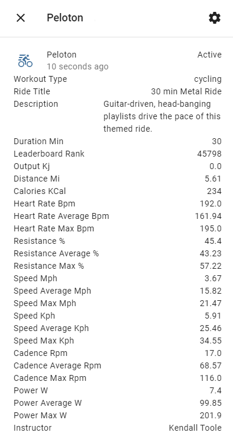

# HomeAssistant Peloton Sensor

[](https://github.com/hacs/integration)

### Overview
HomeAssistant-Peloton-Sensor is an integration for [HomeAssistant](https://www.home-assistant.io/) that exposes your latest or current Peloton Workout session as a sensor. This can be useful to toggle lights, fans, or scenes according to your workout. 
- Sensor state shows either `Complete` or `In Progress`
- State Attributes include:
  - Workout Type
  - Ride Title
  - Device Type
  - Paused
  - Description
  - Start Time
  - End Time
  - FTP
  - Duration Min
  - Leaderboard Rank
  - Leaderboard Users
  - Output Kj
  - Distance Mi
  - Calories KCal
  - Heart Rate Average Bpm
  - Heart Rate Max Bpm
  - Resistance Average
  - Resistance Max
  - Speed Average Mph
  - Speed Max Mph
  - Speed Average Kph
  - Speed Max Kph
  - Cadence Average Rpm
  - Cadence Max Rpm
  - Power Average W
  - Power Max W
  - Total Work
  - Instructor
  - Workout Image
  - Heart Rate Bpm
  - Resistance
  


### Under the Hood
This integration uses [Pylotoncycle](https://pypi.org/project/pylotoncycle/) to poll Peloton's API. Keep in mind that polling won't be instant when creating Automations. 

### Integration Installation
#### Using HACS

#### Manually Copy Files
Download this repository and place the `custom_components/peloton/` directory within a folder called `custom_components/` in the root of your HomeAssistant Configuration directory. A forced reboot of HomeAssistant may be required in order for HomeAssistant to silence errors about missing dependancies (which will be installed upon reboot). 

### configuration.yaml (UI Based Config Coming Soon™)
A simple sensor configuration is required:

```
sensor:
  - platform: peloton
    username: thedude
    password: paSSw0rdz
  - platform: peloton
    username: thedudette
    password: paSSw0rdz
```

This will give you a sensor named `sensor.peloton_USERNAME` - allowing for multiple instances!

### Additional Sensors via Templating
Sometimes it's easier to work with the state directly, which will retain state history via the recorder. 
```
sensor:
  - platform: template
    sensors:
    power_output:
      friendly_name: "Power Output"
      value_template: >
        {{ state_attr('sensor.peloton_username', "Workout Type" ) }}
```

## Use Cases
- Automate lights and fans when you start or end a workout, or when your output exceeds a certain threshold. 
- Motovation - make HomeAssistant remind you to workout!
- Export your ride stats to InfluxDB.

### ToDo
* Configuration via the UI (required for official HASS integration).
* Expose more useful information by examining the entire JSON Object or other endpoints (PRs Welcome!)

### Final Thoughts
Please feel free to critique the code as well as submit feature requests or additions! The Goal is to turn this into an award winning HomeAssistant Integration!
