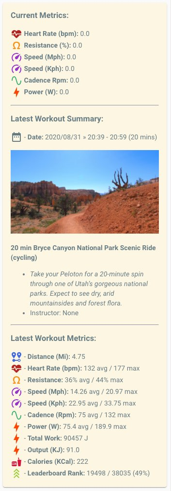

##  Markdown Template

An example markdown card, showing all available attributes 

The Current metrics section is only displayed when resistance > 0 (implying the bike is currently in use)

You will need to search/replace `sensor.peloton_username` with own sensor name 

## Preview 



## Yaml (for Lovelace)

````
type: markdown
content: >+
  {% if state_attr('sensor.peloton_username', "Resistance %") | float > 0 -%}
  ### Current Metrics:
  
  <font color="firebrick"><ha-icon icon="mdi:heart-pulse"></ha-icon></font> **Heart Rate (bpm):** {{ state_attr('sensor.peloton_username', "Heart Rate Bpm") }}
  <font color="darkorange"><ha-icon icon="mdi:omega"></ha-icon></font> **Resistance (%):** {{ state_attr('sensor.peloton_username', "Resistance %") }}
  <font color="darkorchid"><ha-icon icon="mdi:speedometer"></ha-icon></font> **Speed (Mph):** {{ state_attr('sensor.peloton_username', "Speed Mph") }}
  <font color="darkorchid"><ha-icon icon="mdi:speedometer"></ha-icon></font> **Speed (Kph):** {{ state_attr('sensor.peloton_username', "Speed Kph") }}
  <font color="mediumseagreen"><ha-icon icon="mdi:sine-wave"></ha-icon></font> **Cadence Rpm:** {{ state_attr('sensor.peloton_username', "Cadence Rpm") }}
  <font color="orangered"><ha-icon icon="mdi:lightning-bolt"></ha-icon></font> **Power (W):** {{ state_attr('sensor.peloton_username', "Power W") }}
  
  ---
  
  
  
  ### Latest Workout Summary:
  
  <ha-icon icon="mdi:calendar-range"></ha-icon>  - **Date:** {{ state_attr('sensor.peloton_username', "Start Time")|float|timestamp_custom('%Y/%m/%d &raquo; %H:%M') }} - {{ state_attr('sensor.peloton_username', "End Time")|float|timestamp_custom('%H:%M') }} ({{ state_attr('sensor.peloton_username', "Duration Min") }} mins)
  
  
    
  
  
  **{{ state_attr('sensor.peloton_username', "Ride Title") }} ({{ state_attr('sensor.peloton_username', "Workout Type") }})**
  - *{{ state_attr('sensor.peloton_username', "Description") }}* 
  - Instructor: {{ state_attr('sensor.peloton_username', "Instructor") }}
  
  ---
  
  ### Latest Workout Metrics:
  
  <font color="royalblue"><ha-icon icon="mdi:map-marker-distance"></ha-icon></font>  - **Distance (Mi):** {{ state_attr('sensor.peloton_username', "Distance Mi") | float | round(2) }}
  <font color="firebrick"><ha-icon icon="mdi:heart-pulse"></ha-icon></font> - **Heart Rate (bpm):** {{ state_attr('sensor.peloton_username', "Heart Rate Average Bpm") | float | round(0) }} avg / {{ state_attr('sensor.peloton_username', "Heart Rate Max Bpm")  | float | round(0) }} max
  <font color="#50C4AA"><ha-icon icon="mdi:heart-pulse"></ha-icon></font> - **Time in Zone 1:** {{state_attr('sensor.peloton_username', "HR Zone 1 Time")}} minutes
  <font color="#B6C95C"><ha-icon icon="mdi:heart-pulse"></ha-icon></font> - **Time in Zone 2:** {{ state_attr('sensor.peloton_username', "HR Zone 2 Time")}} minutes
  <font color= "#FACB3E"><ha-icon icon="mdi:heart-pulse"></ha-icon></font> - **Time in Zone 3:** {{ state_attr('sensor.peloton_username', "HR Zone 3 Time")}} minutes
  <font color= "#FC800F"><ha-icon icon="mdi:heart-pulse"></ha-icon></font> - **Time in Zone 4:** {{state_attr('sensor.peloton_username', "HR Zone 4 Time")}} minutes
  <font color= "#FF4759"><ha-icon icon="mdi:heart-pulse"></ha-icon></font> - **Time in Zone 5:** {{ state_attr('sensor.peloton_username', "HR Zone 5 Time")}} minutes
  <font color="darkorange"><ha-icon icon="mdi:omega"></ha-icon></font> - **Resistance:** {{ state_attr('sensor.peloton_username', "Resistance Average %") | float | round(0) }}% avg / {{ state_attr('sensor.peloton_username', "Resistance Max %") | float | round(0) }}% max
  <font color="darkorchid"><ha-icon icon="mdi:speedometer"></ha-icon></font> - **Speed (Mph):** {{ state_attr('sensor.peloton_username', "Speed Average Mph")  | float | round(2) }}  avg / {{ state_attr('sensor.peloton_username', "Speed Max Mph")  | float | round(2) }} max
  <font color="darkorchid"><ha-icon icon="mdi:speedometer"></ha-icon></font> - **Speed (Kph):** {{ state_attr('sensor.peloton_username', "Speed Average Kph")  | float | round(2) }}  avg / {{ state_attr('sensor.peloton_username', "Speed Max Kph")  | float | round(2) }} max
  <font color="mediumseagreen"><ha-icon icon="mdi:sine-wave"></ha-icon></font> - **Cadence (Rpm):** {{ state_attr('sensor.peloton_username', "Cadence Average Rpm")  | float | round(0) }} avg / {{ state_attr('sensor.peloton_username', "Cadence Max Rpm")  | float | round(0) }} max
  <font color="orangered"><ha-icon icon="mdi:lightning-bolt"></ha-icon></font> - **Power (W):** {{ state_attr('sensor.peloton_username', "Power Average W")  | float | round(2) }} avg / {{ state_attr('sensor.peloton_username', "Power Max W")  | float | round(2) }} max
  <font color="orangered"><ha-icon icon="mdi:lightning-bolt"></ha-icon></font> - **Total Work:** {{ state_attr('sensor.peloton_username', "Total Work")  | float | round(0) }} J
  <font color="orangered"><ha-icon icon="mdi:lightning-bolt"></ha-icon></font> - **Output (KJ):** {{ state_attr('sensor.peloton_username', "Output Kj")  | float | round(2) }}
  <font color="crimson"><ha-icon icon="mdi:food"></ha-icon></font> - **Calories (KCal):** {{ state_attr('sensor.peloton_username', "Calories KCal") }}
  <font color="yellowgreen"><ha-icon icon="mdi:chevron-triple-up"></ha-icon></font> - **Leaderboard Rank:** {{ state_attr('sensor.peloton_username', "Leaderboard Rank") }} / {{ state_attr('sensor.peloton_username', "Leaderboard Users") }} ({{ 100 - (100 * (state_attr('sensor.peloton_username', "Leaderboard Rank") | int ) / (state_attr('sensor.peloton_username', "Leaderboard Users") | int)) | round(0) }}%)
theme: solarized_light
````

